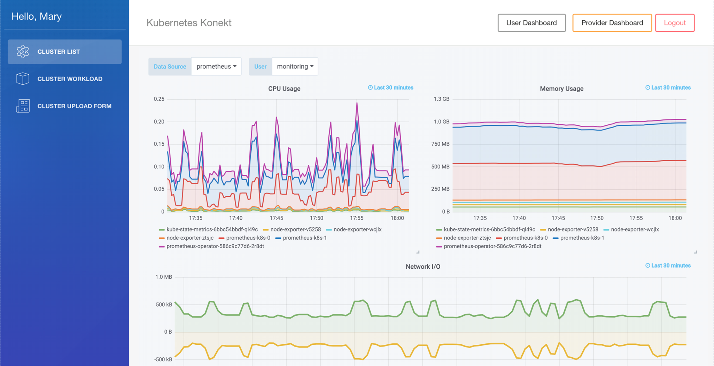
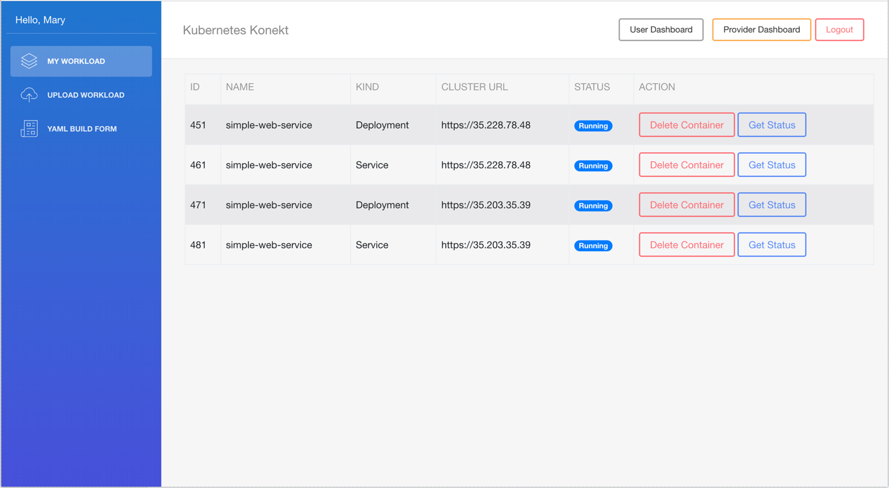
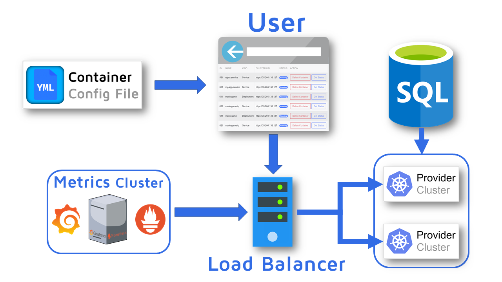
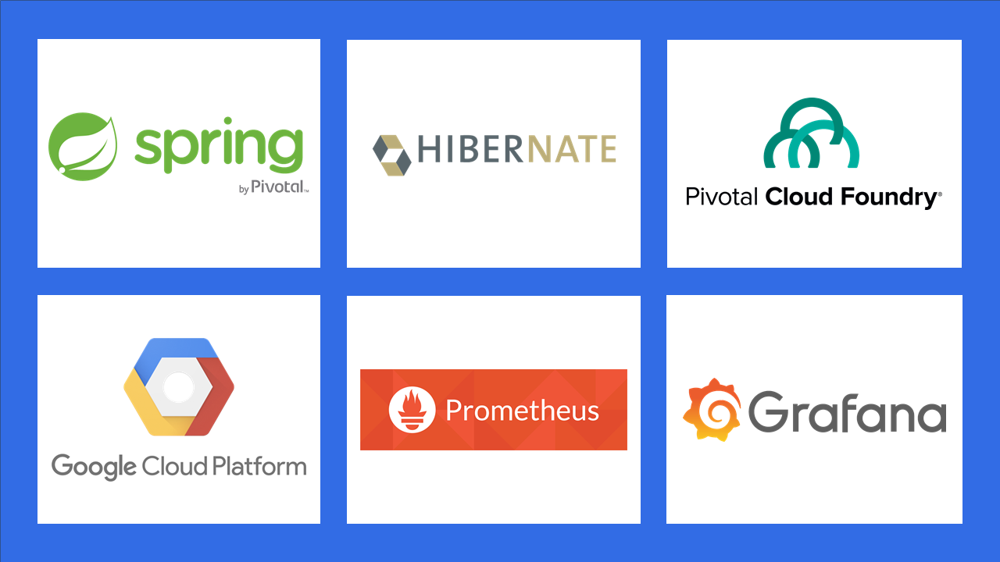

```
 Jesmar Castillo (Lead) | Marco Chavez (Scribe) | Durva Kapadne | Jack Liu | Kindy Tan
```
# Kubernetes Koneket
A platform where users can create services and providers supply the cloud resources.

### Latest Instructions:
- ~~Visit https://kubernetes-konekt.cfapps.io/ to access demo.~~ No funds available to host.

## Features
### Real-time Cluster Performance Metrics



### Manage Deployments


## Backend
### Architecture

### Technologies Used


### Current State:
- User Accounts managed with Spring Security on MySQL database
- Provider: can upload cluster URL and credentials
- User: can launch Kubernetes resources with a YAML file

### TODO:
- Refactor Kubernetes API client (TOP PRIORITY)
- Fix load balancer concurrency issues
- Improve YAML builder
